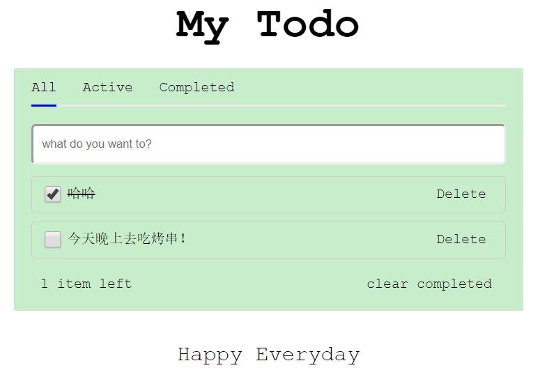

# vue-todo-ssr

> vue-todo 使用了服务端渲染

### 技术栈

**vue 全家桶 + vue 服务端渲染 + koa + APICloud**

### 说明

- 使用的是 Bundle Render 和手动注入模板的方式。
- [演示地址](http://todo.haledeng.com)

### 项目结构

```bash
|—— build        webpack 配置文件
|—— client       客户端相关代码
|—— server       服务端相关代码
|—— dist-client  编译后的前端打包代码和服务端渲染需要的 json 文件
|—— dist-server  编译后的服务端渲染后端 json 文件
```

### 安装和启动

```bash
# install dependencies
yarn

# serve with hot reload at localhost:8080 and 8081 for production dev
yarn dev

# build for production env
yarn build

# setup app for production env
yarn start

# setup app for pm2
yarn pm2
```

### 图片



### 其他

- 服务端渲染会消耗服务器性能，不管是 Vue 还是 React 官方都不是很推荐使用

- 如果一定要使用，建议使用社区的成熟方案 [nuxt](https://github.com/nuxt/nuxt.js) 、[next](https://github.com/zeit/next.js) ，避免踩更多的坑。nuxt 可参考：[nuxt-trailer](https://github.com/haledc/nuxt-trailer)

- 服务端渲染原理请参考 [react-ssr](https://github.com/haledc/react-ssr/blob/master/README.md#%E5%AE%9E%E7%8E%B0%E5%8E%9F%E7%90%86) 实现原理，思想都是一样的。

- 本来想重构成类似 [react-ssr](https://github.com/haledc/react-ssr/blob/master) 结构的，node 渲染和后端接口服务器分开，node 作为中间层，但是发现好多坑需要填，以后再重构吧。
